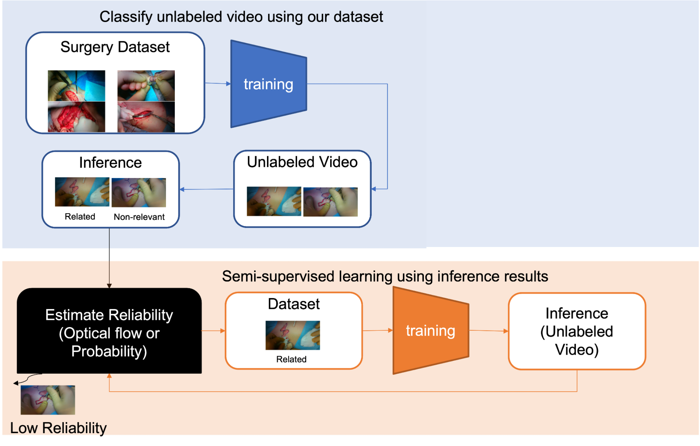

# RIF
Removing irrelevant frames in plastic surgery videos using semi-supervised learning combined with optical flow.(Poster presentation at CARS2022)

# 目次
     
1. [**About**](#about)
2. [**Getting started**](#getting-started)
     1. [**Prerequisites**](#prerequisites)
     2. [**Usage**](#usage)


# About
オプティカルフローと半教師あり学習を用いた形成外科手術動画の自動分類


<p align="center">
     
</p>

# Getting started

## Prerequisites
- ffmpegをインストール
- [wandb](https://wandb.ai/site)のアカウントを作成
- 以下のコードを実行

```
pip install -r requirements.txt
```


## Usage

元動画はvideosの下に動画名と同じ名前のディレクトリを作成し、その下に保存する

### - 術野がフレームを除去した動画を作成する
config/config_main.yaml のvideo_nameを変更し、以下のコードを実行

```
python main.py 
```
### - Train model
動画からTrain or Testデータを作る場合：
```

python src/utils/split_videos.py -data train(test) -name [videoname]

```
以下を実行しモデルを学習:
```

python train.py 

```


